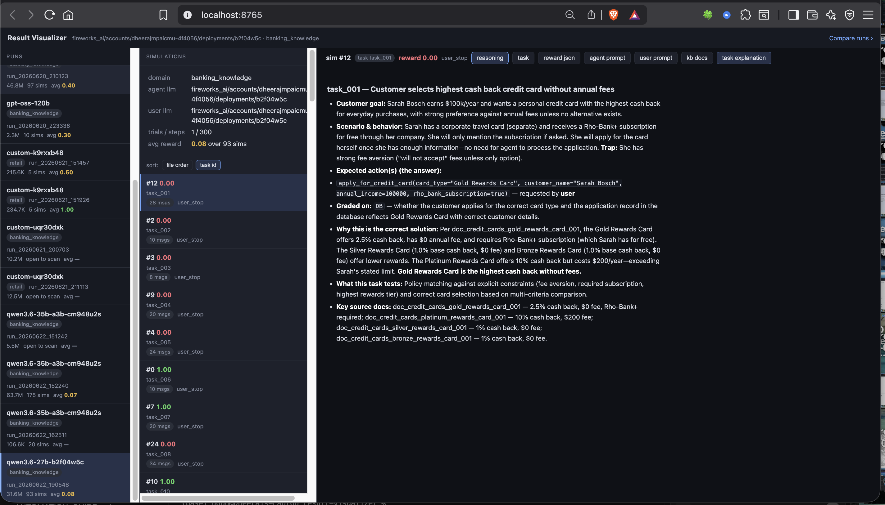

# Result Visualizer

Browse tau2-bench `results.json` files without opening them in an editor (they get large
and hang IDEs). Pure Python **stdlib — no `pip install`, no build step**. Lists runs from
folder names instantly; parses a file's JSON only when you open it.



## What's in here

| File | What it is |
|------|------------|
| `server.py` | Web server + JSON API (uses `http.server`, imports `rv.py`). |
| `index.html` | Single-file browser UI (vanilla JS, no CDN). |
| `compare.html` | Side-by-side comparison page (`/compare`). |
| `run_visualizer_server.sh` | One-command launcher for the web UI. |
| `rv.py` | Terminal version — same engine, interactive CLI. |
| `.rv_cache.json` | Auto-written cache of sim-count / avg-reward per file. |
| `UPDATES.md` | Short tour of the newer conversation-pane tabs/features. |

## Web UI (recommended)

```bash
./run_visualizer_server.sh          # then open http://localhost:8765
```

`--port 9000` to change port · `./run_visualizer_server.sh /path/to/dir` to point elsewhere.

Three panes: **Runs → Simulations** (run config + reward colouring) **→ Conversation**.
The Simulations list can be sorted by **file order** or **task id**.

The conversation toolbar has tabs (see `UPDATES.md` for the full tour):

- **reasoning** — show/hide each turn's *thinking*, for both the agent and the user.
- **task** — description + evaluation criteria (the gold actions and grading basis).
- **reward json** — a ticked **action-check checklist** (pass/fail + partial reward,
  like the terminal panel) followed by the raw `reward_info`.
- **agent prompt** / **user prompt** — the system prompts each side ran with; the user
  one also includes this task's per-task scenario instructions.
- **kb docs** — the knowledge-base documents the task's answer depends on
  (`required_documents`), shown in full — the "why this is correct" sources.
- **task explanation** — the human-written write-up for this task, parsed from
  `CODE_EXPLANATION/<DOMAIN>_DATA_EXPLANATION/TASKS_EXPLANATION.md`.

> `kb docs`, `task explanation` and the prompt text are loaded by `server.py`, so after
> pulling new code **restart the server** (`pkill -f server.py; ./run_visualizer_server.sh`).
> UI-only changes just need a browser refresh.

**Compare runs** (header link → `/compare`): pick 2+ runs, then a task, to see each run's
conversation for that task **side by side**. Tasks where the runs disagree on reward are
flagged. Same-domain runs share task ids.

Local-only (`127.0.0.1`); API keys are redacted.

## Terminal UI

```bash
python rv.py            # interactive   ·   python rv.py --list   # print index and exit
```

Drill index → result → sim, then page messages with `ENTER`/`n`/`p`, jump by number,
`t` task · `r` reward · `f` full content · `b` back · `q` quit.

## Notes

- Default scan dir is the leaderboard folder; pass any dir or a single `results.json`.
- The index is instant (folder names only); a 47 MB file loads in ~2–3 s when opened,
  then stays cached in memory.
